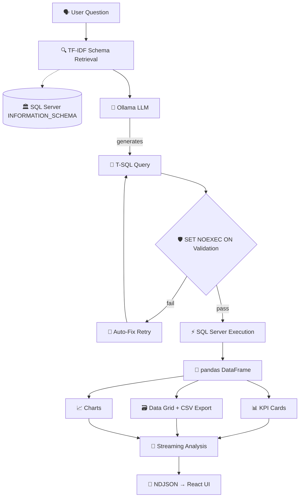

# ⬢ GAWAIN ENGINE
### 🏢 Enterprise Data Intelligence — Secure RAG System
### アラサカ — データインテリジェンス

[](https://github.com/AvinavKhadka/gawain-engine)
[](https://python.org)
[](https://react.dev)
[](https://ollama.com)

**Gawain Engine — Arasaka Edition** is a production-grade **Retrieval-Augmented Generation (RAG)** system for **SQL Server**. It translates natural-language questions into validated **T-SQL**, executes securely, and streams **KPI cards**, **interactive tables**, **charts**, and **written analysis** — all powered locally via **Ollama** (no cloud dependency) 💾🔒

> **アラサカ — 安全なデータ分析** — Secure, local-first business intelligence.

---

## 📡 Architecture — How It Works



---

## ✨ Features

| 🧩 Module | 📝 Details |
|-----------|------------|
| **🗣️ Natural Language → SQL** | Supports any local Ollama model — `llama3.1`, `codellama`, custom finetunes |
| **🛡️ Pre-Execution Validation** | `SET NOEXEC ON` syntax check before executing |
| **🔧 Auto SQL Repair** | Automatic retry with error context if execution fails |
| **🧠 Multi-Turn Memory** | Last 6 conversation turns included as context |
| **🔍 Dynamic Schema Retrieval** | TF-IDF ranking — only relevant tables per question, scales to 1000+ tables |
| **🏢 Any-Database Support** | `DB_TABLE_FILTER` whitelist — point at any SQL Server database |
| **🗺️ Multi-Step Planning** | Decomposes complex questions (`vs`, `and`, `correlation`) into sub-queries |
| **📈 Chart Auto-Detection** | Line, Bar, Stacked Bar, Doughnut, Scatter — with Arasaka palette |
| **✏️ SQL Editor** | Edit generated SQL in-browser and re-run |
| **⬇️ CSV Export** | One-click export from any result table |
| **📜 Query History** | SQLite log with favorites — `アーカイブ` |
| **📌 Dashboard** | Pin charts/tables → persistent dashboard (localStorage) |
| **🌊 Streaming UI** | NDJSON token streaming — React + AG Grid + Chart.js |
| **🎯 Driver Analysis** | DuckDB local extract for attribution & changepoint detection |

---

## 🧰 Prerequisites

| 🧪 Requirement | 📦 Version | 📝 Notes |
|---------------|-----------|----------|
| **Python** | `3.11+` | `python --version` |
| **Node.js** | `18+` | `node --version` |
| **SQL Server** | `2019+` | Express edition works |
| **ODBC Driver 17** | for SQL Server | [Download](https://learn.microsoft.com/en-us/sql/connect/odbc/download-odbc-driver-for-sql-server) |
| **Ollama** | latest | [ollama.com](https://ollama.com) |
| **RAM** | `8GB+` | 16GB recommended for LLMs |

---

## 🗄️ 1️⃣ SQL Server Setup

### 🅰️ Option A — AdventureWorksDW2019 (Demo Database) 🚲

Default demo — bicycle & accessories, 2010-2014, $29.4M / 60K orders.

1. **Download** `.bak`:
   ```
   https://github.com/Microsoft/sql-server-samples/releases/tag/adventureworks
   ```
2. **Restore** in SSMS:
   ```sql
   RESTORE DATABASE AdventureWorksDW2019
   FROM DISK = 'C:\path\to\AdventureWorksDW2019.bak'
   WITH MOVE 'AdventureWorksDW2019' TO 'C:\Data\AdventureWorksDW2019.mdf',
        MOVE 'AdventureWorksDW2019_log' TO 'C:\Data\AdventureWorksDW2019_log.ldf',
        REPLACE;
   ```
3. **Verify** 🧪:
   ```sql
   USE AdventureWorksDW2019;
   SELECT COUNT(*) FROM dbo.FactInternetSales;  -- 60398 ✅
   ```

### 🅱️ Option B — Your Own Database

Set `DB_DATABASE` in `.env` to any SQL Server DB.  
Optionally set `DB_TABLE_FILTER` to comma-separated tables — leave empty for all tables 🏢

---

## 🧠 2️⃣ Ollama Setup

```bash
# Install from ollama.com, then:

ollama pull llama3.1:latest      # 🟢 Recommended ~5GB
ollama pull llama3.2:3b          # ⚡ Light ~2GB — fast on CPU
ollama pull codellama:13b        # 💻 Code-specialized

ollama list
ollama serve                     # auto-starts on Windows
curl http://localhost:11434/api/tags
```

> 💡 For custom-tuned models, see **Train/README.md** 🧬

---

## 🐍 3️⃣ Python Backend Setup

```bash
cd gawain-engine

python -m venv .venv
.venv\Scripts\activate          # Windows
# source .venv/bin/activate     # Linux/Mac

pip install -r requirements.txt
```

### ⚙️ Configure `.env`

```bash
copy .env.example .env          # Windows
# cp .env.example .env          # Linux/Mac
```

```ini
# 🏛️ SQL Server
DB_SERVER=YOUR_PC\SQLEXPRESS
DB_DATABASE=AdventureWorksDW2019
DB_DRIVER=ODBC Driver 17 for SQL Server

# 🔐 Windows Auth — leave blank
DB_USER=
DB_PASSWORD=

# 🧠 Ollama
OLLAMA_BASE_URL=http://localhost:11434
OLLAMA_MODEL=llama3.1:latest

# 🎯 Optional whitelist
DB_TABLE_FILTER=

# 📊 Driver Analysis
STAR_FACT=dbo.FactInternetSales
STAR_MEASURES=SalesAmount,OrderQuantity,TotalProductCost
```

---

## 🎨 4️⃣ Frontend Setup — アラサカデザイン

Arasaka theme: dark `NIGHT_OPS` 🌑 `#05070d` + red `#ff003c`, and light `DAY_PROTOCOL` ☀️ — toggle in header `◑ / ◐`

```bash
cd frontend
npm install
npm run build          # builds to ../static/ — 295KB CSS
cd ..
```

**Dev mode with HMR** 🖥️:
```bash
# Terminal 1 — Backend :8000
.venv\Scripts\activate
python -m uvicorn main:app --host 0.0.0.0 --port 8000 --reload

# Terminal 2 — Frontend :5173
cd frontend
npm run dev
```

---

## 🚀 5️⃣ Running the Application

### ⚡ Quick Start (Windows)

```bat
start.bat
```

### 🛠️ Manual Start

```bash
.venv\Scripts\activate
python -m uvicorn main:app --host 0.0.0.0 --port 8000 --reload
```

Open **http://localhost:8000** 🌐 — you should see ⬢ ARASAKA header with triskele emblem.

---

## 🧪 6️⃣ Verification

```bash
curl http://localhost:8000/api/health
# → {"ollama": true, "database": true} ✅

python test_pipeline.py

# Try in UI:
# "Show total revenue by year"
# "Top 10 customers by total spend"
```

**If you see old blue UI:**
```bash
cd frontend
npm run build
# Browser: Ctrl+Shift+R
# Console: localStorage.clear(); location.reload();
```

---

## 🗂️ 7️⃣ Project Structure

```
gawain-engine/
├── main.py                  # 🚪 FastAPI entry — serves static + API
├── requirements.txt
├── start.bat                # ⚡ Windows launcher
├── .env / .env.example
│
├── config/                  # ⚙️ Configuration
│   ├── settings.py          # DB, Ollama, chart colors — アラサカ設定
│   └── prompts.py           # 🧠 System prompt
│
├── server/                  # 🧠 Backend
│   ├── routes.py            # 🛣️ Endpoints + NDJSON streaming
│   ├── llm.py               # 🤖 Ollama SQL generation & analysis
│   ├── database.py          # 🗄️ Execution, schema, chart detection
│   ├── history.py           # 📜 SQLite history
│   ├── drivers.py           # 🎯 DuckDB driver analysis
│   └── schema_retrieval.py  # 🔍 TF-IDF ranking
│
├── frontend/                # 🎨 React + TypeScript — Arasaka theme
│   └── src/
│       ├── App.tsx
│       ├── App.css          # 🔴 Arasaka design system — 900+ lines
│       ├── components/
│       │   ├── Header.tsx           # 🏢 Triskele emblem + arasaka wordmark — アラサカ
│       │   ├── ChatInput.tsx
│       │   ├── Dashboard.tsx        # 📌 Pinned assets
│       │   ├── DataGrid.tsx         # 🗃️ Grid + CSV + Train
│       │   ├── HistoryPanel.tsx     # 📜 History
│       │   ├── MessageBubble.tsx
│       │   └── TrendChart.tsx       # 📈 Charts
│       └── hooks/
│
├── static/                  # 📦 Build output (gitignored)
├── storage/                 # 💾 history.db + analytics.duckdb (gitignored)
│
└── train/                   # 🧬 Model training
    ├── README.md
    ├── Modelfile
    ├── prepare_data.py
    └── finetune scripts
```

---

## 🔌 8️⃣ API Reference

| Method | Endpoint | Description |
|--------|----------|-------------|
| `GET` | `/api/health` | 🟢 Connectivity status — Ollama + DB |
| `GET` | `/api/schema` | 📖 Full schema context |
| `POST` | `/api/schema/refresh` | 🔄 Reload schema cache |
| `POST` | `/api/chat` | 💬 Main streaming chat (NDJSON) |
| `POST` | `/api/chat/run-sql` | ✏️ Execute edited SQL |
| `GET` | `/api/history` | 📜 List history |
| `POST` | `/api/history/favorite` | ⭐ Toggle favorite |
| `DELETE` | `/api/history/{id}` | 🗑️ Delete entry |
| `GET` | `/api/drivers/status` | 🎯 Driver extract status |
| `POST` | `/api/drivers/rebuild` | 🔧 Rebuild extract |
| `POST` | `/api/train/save` | 🧬 Save training pair |

### 🌊 Stream Events (NDJSON)

```
session → string       🆔 Session UUID
step    → string       🔄 Progress
sql     → string       📜 Generated T-SQL
kpi     → [{label, value}]  📊 KPI cards
grid    → {columns, rows, total}  🗃️ Table data
chart   → {type, title, labels, datasets}  📈 Chart config
token   → string       ✍️ Analysis token
error   → string       💥 Error
done    → ""           ✅ End
```

---

## ⚙️ 9️⃣ Configuration Reference

| Variable | Default | Description |
|----------|---------|-------------|
| `DB_SERVER` | `IMPOSSIBLEISNOT\MSSQLSERVER2019` | SQL Server instance | 
| `DB_DATABASE` | `AdventureWorksDW2019` | Database name |
| `DB_DRIVER` | `ODBC Driver 17 for SQL Server` | ODBC driver |
| `DB_USER` | _(empty)_ | SQL auth user — blank = Windows Auth |
| `DB_PASSWORD` | _(empty)_ | SQL auth password |
| `DB_TABLE_FILTER` | _(empty)_ | Table whitelist |
| `OLLAMA_BASE_URL` | `http://localhost:11434` | Ollama URL |
| `OLLAMA_MODEL` | `llama3.1:latest` | Model name |
| `STAR_FACT` | `dbo.FactInternetSales` | Fact table for driver analysis |
| `STAR_MEASURES` | `SalesAmount,OrderQuantity,TotalProductCost` | Measures |

---

## 🔧 🔟 Troubleshooting — アラサカサポート

### 🔴 `DB Error` / `DB: OFFLINE`
- Check `DB_SERVER` in `.env` — e.g. `YOUR_PC\SQLEXPRESS`
- Can you connect via SSMS?
- Ensure SQL Server Browser service running + port 1433 allowed
- `curl http://localhost:8000/api/health` → `database: false` confirms DB issue

### 🔴 `Ollama Offline` / `NEURAL: OFFLINE`
- Run `ollama serve` in separate terminal
- `ollama list` — model exists?
- Check `OLLAMA_BASE_URL` = `http://localhost:11434`
- `curl http://localhost:11434/api/tags` should list models

### 🐌 Wrong or slow SQL generation
- **Slow:** Use smaller model `llama3.2:3b` or enable GPU
- **Wrong:** 
  - Review `config/prompts.py` — does it match your DB?
  - Narrow context via `DB_TABLE_FILTER`
  - In UI: `EDIT // RE-EXECUTE` → correct → `◈ TRAIN_CORE` to save example
  - See train guide for finetuning

### 🎨 Shows old Barclays blue `#00AEEF` instead of Arasaka red
- Frontend is serving old `static/`:
  ```bash
  cd frontend
  npm run build
  # Browser: Ctrl+Shift+R
  # Console: localStorage.clear(); location.reload();
  ```
- Dev mode avoids this: `npm run dev` → `:5173`

### 🟥 Logo cut off / incomplete circle
- ViewBox must be padded with `overflow:visible`
- In `Header.tsx`: `viewBox="-80 -60 1184 540"` + `style={{overflow:"visible"}}`
- In `App.css`: `.arasaka-mark-auth { flex:0 0 52px; overflow:visible; }` + `.arasaka-emblem-svg { transform:scale(1.75); }`
- To fit header: `width:42px` + `scale(1.0)` = 42px perfect fit

---

## 🧬 1️⃣1️⃣ Model Training — アラサカ学習

Want Gawain to understand *your* schema, not just AdventureWorks?

See **[train/README.md](train/README.md)**:
- 🚀 **5-min Modelfile** — no GPU, bake prompt + few-shots
- 🏋️ **1-4hr LoRA finetune** — llama.cpp, learns your schema deeply
- 🧪 **Data prep** — generate 50-200 Q&A pairs from live DB

---

## 📄 Credits — アラサカクレジット

- **Design:** Arasaka theme — red `#ff003c` + black `#05070d`, authentic triskele emblem traced from Cyberpunk 2077 — アラサカ
- **Stack:** FastAPI + Ollama + SQL Server + React + AG Grid + Chart.js + DuckDB
- **Fonts:** JetBrains Mono + Orbitron + Rajdhani (with アラサカ)
- **Principle:** Secure, local-first, no cloud dependency 🔒💾
