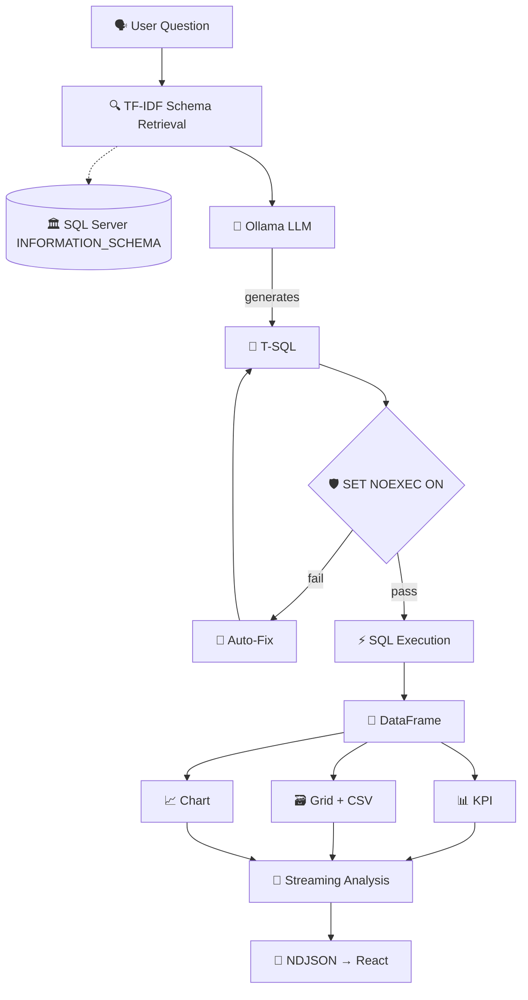

# Gawain Engine


[](https://python.org)
[](https://fastapi.tiangolo.com)
[](https://react.dev)
[](https://www.typescriptlang.org)
[](https://ollama.com)
[](#-docker--production-deployment)
[](https://github.com/AvinavKhadka/gawain-engine/actions)
[](./README.md)

![Dark cyberpunk styled hero banner centered on a black background with a red triskele emblem and the project title Gawain Engine. The banner shows the tagline Natural language → T-SQL → KPI cards, tables & charts — all locally, no cloud. Visual tone is futuristic, bold, and tactical with high-contrast red and black colors.]

> **Natural language → T-SQL → KPI cards, tables & charts — all locally, no cloud.**
> Visual theme: **Arasaka** — red `#ff003c` / black `#05070d` / authentic triskele emblem — アラサカ

---

## Overview

**Gawain Engine** is a production-grade **Retrieval-Augmented Generation (RAG)** system for **SQL Server**. 

You ask in English: *"Why did Bikes revenue drop 12% in 2013 vs 2012?"*

It:
1. 🔍 Retrieves relevant schema via **TF-IDF** on `INFORMATION_SCHEMA`
2. 🧠 Generates validated **T-SQL** via **Ollama LLM** (locally)
3. 🛡️ Validates with `SET NOEXEC ON`, auto-fixes on error
4. ⚡ Executes against SQL Server → **pandas DataFrame**
5. 📊 Returns **KPI cards**, **AG Grid table** (+ CSV), **Chart.js charts**, and a **streaming analysis** with conversation memory

Built for real businesses — works with **any SQL Server DB**, not just the demo.

**Frontend theme** is inspired by Arasaka Corporation from Cyberpunk 2077 — dark `NIGHT_OPS` `#05070d` + `DAY_PROTOCOL` light mode, cut-corner tactical UI, JetBrains Mono + Orbitron, authentic triskele emblem `⬢`. The theme is purely visual; the project itself is **Gawain Engine**.

---

## ✨ Features

| 🧩 Module | 📝 What it does |
|-----------|-----------------|
| **🗣️ NL → SQL** | Any local Ollama model — `llama3.1`, `codellama`, custom finetunes |
| **🛡️ Pre-Execution Validation** | `SET NOEXEC ON` check before hitting data |
| **🔧 Auto SQL Repair** | LLM retries with error context |
| **🧠 Multi-Turn Memory** | Last 6 turns as context |
| **🔍 Dynamic Schema Retrieval** | TF-IDF — only relevant tables per question, scales to 1000+ tables |
| **🏢 Any-Database** | `DB_TABLE_FILTER` whitelist — point at any SQL Server DB |
| **🗺️ Multi-Step Planning** | Decomposes `vs / and / correlation` into sub-queries |
| **📈 Chart Auto-Detect** | Line, Bar, Stacked Bar, Doughnut, Scatter |
| **✏️ SQL Editor** | Edit generated SQL in-browser and re-run |
| **⬇️ CSV Export** | One-click from any grid |
| **📜 Query History** | SQLite log + favorites — アーカイブ |
| **📌 Dashboard** | Pin charts/tables → persistent (localStorage) |
| **🌊 Streaming UI** | NDJSON token-by-token — React + AG Grid + Chart.js |
| **🎯 Driver Analysis** | DuckDB extract for attribution & changepoint detection — `DRIVERS` panel |
| **🎨 Theme** | Arasaka-inspired dark/light toggle `◑ / ◐` — red chrome, grid + scanlines |

---

## 🏗 Architecture


```mermaid
flowchart TD
    A[🗣️ User Question] --> B[🔍 TF-IDF Schema Retrieval]
    B -.-> C[(🏛️ SQL Server INFORMATION_SCHEMA)]
    B --> D[🧠 Ollama LLM]
    D -- generates --> E[📜 T-SQL]
    E --> F{🛡️ SET NOEXEC ON}
    F -- fail --> G[🔧 Auto-Fix]
    G --> E
    F -- pass --> H[⚡ SQL Execution]
    H --> I[🐼 DataFrame]
    I --> J[📊 KPI]
    I --> K[🗃️ Grid + CSV]
    I --> L[📈 Chart]
    J & K & L --> M[🧠 Streaming Analysis]
    M --> N[💬 NDJSON → React]
```

**Request flow:**
- `POST /api/chat` → streams `session → step → sql → kpi → grid → chart → token* → done`
- Client: `useChat.ts` parses NDJSON line-by-line for instant UI updates
- History: SQLite `storage/history.db` + in-memory session store (last 6 turns)

---

## 🛠 Tech Stack

| Layer | Tech | Details |
|-------|------|---------|
| **Backend** | Python 3.11 + FastAPI 0.115 + Uvicorn | `main.py` mounts `static/` + `/assets` |
| **DB Access** | pyodbc 5.2 + ODBC Driver 17 | `SET NOEXEC ON` validation, pandas execution |
| **LLM** | Ollama (local) — llama3.1 / codellama / finetuned | No cloud calls |
| **Analysis** | DuckDB 1.1 + scikit-learn + pandas | Driver attribution, key influencers, changepoint |
| **Frontend** | React 19 + TypeScript 6 + Vite 8 | `frontend/` → `static/` |
| **UI Libs** | AG Grid 35 + Chart.js 4 + JetBrains Mono + Orbitron | Tables + charts |
| **Storage** | SQLite (history) + DuckDB (analytics extract) | `storage/` dir, gitignored |
| **Theme** | Arasaka-inspired — CSS custom props, clip-path tactical, grid + scanlines | `App.css` 900+ lines — アラサカデザイン |
| **DevOps** | Docker multi-stage (Node 22 → Python 3.11 slim + msodbcsql17/18) | `Dockerfile` + `docker-compose.yml` |

---

## 🚀 Quick Start

### Prerequisites

| Requirement | Version | Check |
|-------------|---------|-------|
| Python | 3.11+ | `python --version` |
| Node.js | 18+ | `node --version` |
| SQL Server | 2019+ | Express works |
| ODBC Driver 17 | | [Download](https://learn.microsoft.com/en-us/sql/connect/odbc/download-odbc-driver-for-sql-server) |
| Ollama | latest | [ollama.com](https://ollama.com) |
| Docker (optional) | 24+ | `docker --version` |

### 1️⃣ SQL Server — Demo DB

```powershell
# Download AdventureWorksDW2019.bak from:
# https://github.com/Microsoft/sql-server-samples/releases/tag/adventureworks

# Restore in SSMS - New Query:
RESTORE DATABASE AdventureWorksDW2019
FROM DISK = 'C:\SQLBackups\AdventureWorksDW2019.bak'
WITH MOVE 'AdventureWorksDW2019' TO 'C:\Data\AdventureWorksDW2019.mdf',
     MOVE 'AdventureWorksDW2019_log' TO 'C:\Data\AdventureWorksDW2019_log.ldf',
     REPLACE;

# Verify:
# USE AdventureWorksDW2019; SELECT COUNT(*) FROM dbo.FactInternetSales; -- 60398
```

Or point `DB_DATABASE` at your own DB — set `DB_TABLE_FILTER` to whitelist tables.

### 2️⃣ Ollama — Local LLM

```bash
ollama pull llama3.1:latest   # ~5GB recommended
ollama list
ollama serve                  # auto-starts on Windows
```

### 3️⃣ Backend

```bash
cd gawain-engine
python -m venv .venv
.venv\Scripts\activate        # Windows
# source .venv/bin/activate   # Mac/Linux
pip install -r requirements.txt

copy .env.example .env        # Windows
# cp .env.example .env

# Edit .env:
# DB_SERVER=.\SQLEXPRESS
# DB_DATABASE=AdventureWorksDW2019
# DB_USER=  (blank = Windows Auth)
# DB_PASSWORD=
# OLLAMA_BASE_URL=http://localhost:11434
```

### 4️⃣ Frontend

```bash
cd frontend
npm install
npm run build   # → ../static/ — 295KB CSS
cd ..
```

Dev mode:
```bash
# Terminal 1 — backend :8000
python -m uvicorn main:app --host 0.0.0.0 --port 8000 --reload

# Terminal 2 — frontend :5173 HMR
cd frontend
npm run dev
```

### 5️⃣ Run

```bat
start.bat   # Windows one-click
# or
python -m uvicorn main:app --host 0.0.0.0 --port 8000 --reload
# → http://localhost:8000
```

Verify:
```bash
curl http://localhost:8000/api/health
# → {"ollama": true, "database": true}
```

---

## 🐳 Docker — Production Deployment

Full-stack: **FastAPI + React (Arasaka theme) + Ollama** — no DB needed at build time, client plugs their SQL Server at runtime.

### Quick Start

```bash
cp .env.docker.example .env
# Edit .env: DB_SERVER=host.docker.internal\SQLEXPRESS, DB_USER=sa, DB_PASSWORD=...

docker compose up --build -d
# → http://localhost:8000  UI
# → http://localhost:11434 Ollama

docker compose logs -f app
```

**Stack:** `app` (Python 3.11 slim + ODBC 17/18 + Node build, :8000) + `ollama` (ollama/ollama:latest, :11434) + optional `mssql` (uncomment in compose for local SQL testing).

Healthchecks are lenient — `app` shows `Up` even if DB offline, UI loads with `DB: OFFLINE` badge — perfect for demo/product.

> ⏳ **First run downloads the LLM (~5 GB).** `docker-entrypoint.sh` pulls `OLLAMA_MODEL` automatically. Watch it with `docker compose logs -f app`. The model persists in the `arasaka_ollama_data` volume, so this is a one-time cost.
>
> Set `OLLAMA_AUTO_PULL=0` to skip the wait-and-pull entirely (useful in CI).

---

### ⚡ GPU acceleration & model choice

Text-to-SQL quality and speed are dominated by two settings.

**Model** — set `OLLAMA_MODEL` in `.env`:

| Model | VRAM | Notes |
|---|---|---|
| `qwen2.5-coder:7b` | ~6 GB | Best join-chain and column recall. Needs a GPU to be comfortable. |
| `qwen2.5-coder:3b` | ~3 GB | Good SQL, usable on CPU. Safe default. |
| `llama3.2:3b` | ~3 GB | General chat model — hallucinates columns and skips dimension tables on star schemas. Not recommended here. |

```bash
docker compose exec ollama ollama pull qwen2.5-coder:7b
# .env → OLLAMA_MODEL=qwen2.5-coder:7b
docker compose up -d --force-recreate app
```

**GPU** — the `ollama` service already reserves all NVIDIA devices. Requires an
up-to-date driver: Ollama needs **550 or newer**, and reports
`NVIDIA driver too old` in its logs if not.

```bash
wsl --shutdown                 # after a driver install, so WSL2 re-reads it
docker compose up -d --force-recreate ollama
docker compose logs ollama | grep -i "inference compute"
```

Look for `library=CUDA` and your GPU name. `library=cpu` means it fell back:

```
library=CUDA compute=8.9 name=CUDA0 description="NVIDIA GeForce RTX 4060 Laptop GPU" total="8.0 GiB"
```

Confirm a loaded model is actually on the GPU — run a query, then in another
terminal:

```bash
docker compose exec ollama ollama ps    # PROCESSOR should read 100% GPU
```

> 💡 `OLLAMA_KEEP_ALIVE=-1` is set in compose so the model stays resident in
> VRAM. Ollama's default unloads after 5 minutes idle, which makes the first
> query after any pause pay the full model-load cost again.

No NVIDIA GPU? Comment out the `deploy:` block under the `ollama` service —
otherwise the container fails to start rather than falling back to CPU.

---

### ⚙️ Which command picks up which change

The single most common source of "I changed it but nothing happened":

| You changed | Command | Why |
|---|---|---|
| Nothing — just want a bounce | `docker compose restart app` | Same container, same image, same env |
| `.env` / `environment:` | `docker compose up -d --force-recreate app` | Env is fixed at container **creation**; `restart` reuses it |
| `docker-compose.yml` | `docker compose up -d` | Compose diffs the config and recreates what changed |
| **Python source** (`server/`, `config/`, `main.py`) | `docker compose up -d --build app` | The Dockerfile `COPY`s code **into the image** — a recreate reuses the old image |
| `Dockerfile` / `requirements.txt` | `docker compose up -d --build app` | Same reason |
| `frontend/` | `docker compose up -d --build app` | Vite build runs in the image's builder stage |

> 💡 **Skip rebuilds while developing.** `docker-compose.yml` mounts `./server`,
> `./config` and `./main.py` read-only into the app container, so a Python edit
> only needs `docker compose restart app` (seconds, not a minute). Comment those
> mounts out to test the real production image — that is what CI builds and what
> ships to GHCR.

Verify what the container actually has, rather than assuming:

```bash
docker compose exec app grep -c "_strip_trailing_limit" server/database.py   # 0 = stale
docker compose exec app env | grep DB_                                       # real env
```

---

## 🎯 Getting to `database: true`

The health endpoint is the fastest way to know where you stand:

```bash
curl http://localhost:8000/api/health
```

| Response | Meaning |
|---|---|
| `{"ollama":true,"database":true}` | ✅ Fully wired — everything works |
| `{"ollama":true,"database":false}` | 🟡 UI + LLM fine, **no DB** — chat/SQL features return errors |
| `{"ollama":false,"database":true}` | 🟡 DB fine, **no LLM** — can't generate SQL |
| `{"ollama":false,"database":false}` | 🟡 Neither attached — app still serves, by design |

**`database: false` is not a crash.** `get_schema()` fails to connect, the exception is caught, and the flag reports `false`. The app stays up on purpose so you can demo the UI without a database. To turn it green, pick the path that matches your setup:

### Path 1 — SQL Server on your host machine (most common)

⚠️ **Windows Authentication does not work from a Linux container.** The container isn't on your Windows domain and has no access to your credentials. You **must** enable SQL Server Authentication and use a SQL login. This is the single most common reason `database` stays `false`.

**1. Enable mixed-mode auth** — SSMS → right-click server → *Properties* → *Security* → select **SQL Server and Windows Authentication mode** → **restart the SQL Server service** (the restart is required).

**2. Create a read-only login:**

```sql
CREATE LOGIN gawain WITH PASSWORD = 'Gawain!2026';
USE YourBusinessDB;
CREATE USER gawain FOR LOGIN gawain;
ALTER ROLE db_datareader ADD MEMBER gawain;
```

`db_datareader` is deliberate — Gawain only ever reads. Don't grant more.

**3. Enable TCP/IP** — *SQL Server Configuration Manager* → *SQL Server Network Configuration* → *Protocols for \<INSTANCE\>* → set **TCP/IP** to **Enabled** → restart the service. Named instances often ship with TCP/IP off, and pyodbc can't connect over shared memory from a container.

**4. Find your exact instance name:**

```powershell
Get-ItemProperty -Path "HKLM:\SOFTWARE\Microsoft\Microsoft SQL Server\Instance Names\SQL"
```

**5. Write `.env`:**

```ini
DB_SERVER=host.docker.internal\SQLEXPRESS
DB_DATABASE=YourBusinessDB
DB_DRIVER=ODBC Driver 18 for SQL Server
DB_USER=gawain
DB_PASSWORD=Gawain!2026
OLLAMA_BASE_URL=http://ollama:11434
```

`host.docker.internal` is the magic hostname that resolves to your Windows/macOS host from inside the container. Use `localhost` and you'll be talking to the container itself.

**6. Apply it** — environment is fixed when the container is *created*, so
`restart` is not enough; the container must be recreated:

```bash
docker compose up -d --force-recreate app
curl http://localhost:8000/api/health
```

> 💡 **ODBC 17 vs 18:** the image ships **both**. Driver 18 encrypts by default and will reject a self-signed server certificate with `SSL Provider: certificate verify failed`. Either stay on `ODBC Driver 17 for SQL Server`, or use 18 and append `;TrustServerCertificate=yes` handling in `config/settings.py`.

### Path 2 — No SQL Server? Run one in Docker

Uncomment the `mssql` service **and** the `mssql_data` volume in `docker-compose.yml`, then:

```bash
mkdir backups   # drop AdventureWorksDW2019.bak here
docker compose up -d mssql ollama

docker compose exec mssql /opt/mssql-tools18/bin/sqlcmd \
  -S localhost -U sa -P "YourStrong!Passw0rd123" \
  -Q "RESTORE DATABASE AdventureWorksDW2019 FROM DISK='/backups/AdventureWorksDW2019.bak' WITH REPLACE" -C
```

Then set `DB_SERVER=mssql`, `DB_USER=sa`, `DB_PASSWORD=YourStrong!Passw0rd123` and `docker compose up -d app`.

Grab the demo `.bak` from [Microsoft's samples release](https://github.com/Microsoft/sql-server-samples/releases/tag/adventureworks).

### Path 3 — Running without Docker

Same rules minus the networking: `DB_SERVER=.\SQLEXPRESS`, and Windows Auth **does** work here — leave `DB_USER` / `DB_PASSWORD` blank.

### Debugging a stubborn `false`

Test the connection from inside the container, which isolates network issues from app issues:

```bash
docker exec -it arasaka-gawain /opt/mssql-tools18/bin/sqlcmd \
  -S host.docker.internal\\SQLEXPRESS -U gawain -P "Gawain!2026" -Q "SELECT DB_NAME()" -C
```

| Error | Cause |
|---|---|
| `Login failed for user` | Mixed-mode auth off, or wrong password |
| `TCP Provider: Error code 0x2AF9` | TCP/IP disabled, or firewall blocking 1433 |
| `certificate verify failed` | Driver 18 + self-signed cert — see the ODBC note above |
| `Data source name not found` | `DB_DRIVER` string doesn't match an installed driver |

List the drivers actually present in the image:

```bash
docker exec arasaka-gawain odbcinst -q -d
```

And check the app's own logs — the entrypoint prints the resolved DB target and ODBC drivers on every boot:

```bash
docker compose logs app | head -20
```

### 🏢 For Clients — Connect YOUR SQL Database

**Decision:**
- Already have SQL Server (`SERVER\INSTANCE`)? → **Option A**
- No SQL / new laptop / demo? → **Option B** (SQL inside Docker)

#### Option A — Existing SQL Server

1. **On SQL machine:**
   - SSMS → Server Properties → Security → **SQL Server and Windows Auth** → Restart service
   - Create login:
     ```sql
     CREATE LOGIN gawain WITH PASSWORD = 'Gawain!2026';
     CREATE USER gawain FOR LOGIN gawain;
     ALTER ROLE db_datareader ADD MEMBER gawain;
     ```
   - SQL Server Configuration Manager → Protocols → Enable **TCP/IP** → Restart
   - Firewall allow `1433`

2. **Find server name (no sqlcmd needed):**
   ```powershell
   Get-Service | Where-Object { $_.Name -like "MSSQL*" }
   Get-ItemProperty -Path "HKLM:\SOFTWARE\Microsoft\Microsoft SQL Server\Instance Names\SQL"
   $env:COMPUTERNAME
   ```

3. **Client `.env`:**
   ```ini
   # Same PC as Docker:
   DB_SERVER=host.docker.internal\SQLEXPRESS
   # Or LAN IP:
   # DB_SERVER=192.168.1.50\SQLEXPRESS

   DB_DATABASE=YourBusinessDB
   DB_USER=gawain
   DB_PASSWORD=Gawain!2026
   OLLAMA_BASE_URL=http://ollama:11434
   ```

4. **Test from container:**
   ```powershell
   docker exec -it arasaka-gawain /opt/mssql-tools18/bin/sqlcmd -S host.docker.internal\SQLEXPRESS -U gawain -P "Gawain!2026" -Q "SELECT DB_NAME()" -C
   ```

#### Option B — No SQL Server? Docker mssql

```yaml
# Uncomment in docker-compose.yml:
mssql:
  image: mcr.microsoft.com/mssql/server:2022-latest
  environment:
    ACCEPT_EULA: "Y"
    SA_PASSWORD: "YourStrong!Passw0rd123"
  ports: ["1433:1433"]
```

```powershell
docker compose up -d mssql ollama
# Put .bak in ./backups/
docker compose exec mssql /opt/mssql-tools18/bin/sqlcmd -S localhost -U sa -P "YourStrong!Passw0rd123" -Q "RESTORE DATABASE AdventureWorksDW2019 FROM DISK = '/backups/AdventureWorksDW2019.bak' WITH REPLACE" -C
# .env: DB_SERVER=mssql, DB_DATABASE=AdventureWorksDW2019
docker compose up -d app
```

#### Build Once, Run Anywhere (B2B)

```bash
docker build -t arasaka-gawain .
docker save arasaka-gawain -o arasaka.tar
# Client: docker load -i arasaka.tar + their .env → docker compose up -d
```

**Licensing:** Developer Edition = free forever for dev/test, Express = free up to 10GB prod. You build without DB, client brings their own — data never leaves premises — アラサカ — 安全なデータ分析 🔒

---

## ⚙ Configuration

| Variable | Default | Description |
|----------|---------|-------------|
| `DB_SERVER` | `IMPOSSIBLEISNOT\MSSQLSERVER2019` | SQL Server instance — `HOST\INSTANCE` or `HOST,PORT` |
| `DB_DATABASE` | `AdventureWorksDW2019` | Database name |
| `DB_DRIVER` | `ODBC Driver 17 for SQL Server` | ODBC driver |
| `DB_USER` | _(empty)_ | SQL auth user — blank = Windows Auth |
| `DB_PASSWORD` | _(empty)_ | SQL password |
| `DB_TABLE_FILTER` | _(empty)_ | Whitelist: `FactInternetSales,DimDate` — empty = all |
| `OLLAMA_BASE_URL` | `http://localhost:11434` | Ollama URL |
| `OLLAMA_MODEL` | `llama3.1:latest` | Model name |
| `STAR_FACT` | `dbo.FactInternetSales` | Fact table for driver analysis |
| `STAR_MEASURES` | `SalesAmount,OrderQuantity,TotalProductCost` | Measures to attribute |

Config lives in `config/settings.py` — chart colors, LLM params, keyword sets — アラサカ設定

---

## 📁 Project Structure

```
gawain-engine/
├── .github/workflows/ci.yaml # ✅ CI: lint, build, container smoke test
├── Dockerfile               # 🐳 Multi-stage: Node + Python + ODBC
├── docker-compose.yml       # 🐳 app + ollama + optional mssql
├── docker-entrypoint.sh     # 🐳 Wait for Ollama + pull model
├── .dockerignore
├── .env.docker.example
│
├── main.py                  # 🚪 FastAPI entry — serves static + API
├── requirements.txt
├── start.bat                # ⚡ Windows launcher
├── .env / .env.example
│
├── config/
│   ├── settings.py          # DB, Ollama, chart colors
│   └── prompts.py           # 🧠 System prompt
│
├── server/
│   ├── routes.py            # 🛣️ Endpoints + NDJSON streaming
│   ├── llm.py               # 🤖 SQL generation & analysis
│   ├── database.py          # 🗄️ Execution, schema, chart detection
│   ├── history.py           # 📜 SQLite history
│   ├── drivers.py           # 🎯 DuckDB driver analysis
│   └── schema_retrieval.py  # 🔍 TF-IDF ranking
│
├── frontend/
│   ├── index.html
│   ├── public/
│   │   ├── favicon.svg              # ⬢ Authentic triskele — アラサカ
│   │   ├── arasaka_logo.svg         # Arasaka emblem vector
│   │   ├── arasaka_wordmark.svg     # arasaka wordmark
│   │   └── icons.svg                # UI icon sprite
│   └── src/
│       ├── App.tsx
│       ├── App.css          # 🔴 Arasaka visual theme — 900+ lines, grid + scanlines
│       ├── components/
│       │   ├── Header.tsx           # 🏢 Authentic triskele — fixed viewBox, tight left
│       │   ├── ChatInput.tsx
│       │   ├── Dashboard.tsx
│       │   ├── DataGrid.tsx
│       │   ├── HistoryPanel.tsx
│       │   ├── MessageBubble.tsx
│       │   └── TrendChart.tsx       # 📈 Arasaka neon palette
│       └── hooks/
│
├── static/                  # 📦 Build output (gitignored)
├── storage/                 # 💾 history.db + analytics.duckdb (gitignored)
│
└── train/
    ├── README.md            # 📚 Training guide — アラサカ学習
    ├── Modelfile
    ├── prepare_data.py
    └── finetune scripts
```

---

## 🔌 API

| Method | Endpoint | Description |
|--------|----------|-------------|
| `GET` | `/api/health` | 🟢 Ollama + DB status |
| `GET` | `/api/schema` | 📖 Full schema context |
| `POST` | `/api/schema/refresh` | 🔄 Reload schema cache |
| `POST` | `/api/chat` | 💬 Main chat (NDJSON stream) |
| `POST` | `/api/chat/run-sql` | ✏️ Execute edited SQL |
| `GET` | `/api/history` | 📜 List history |
| `POST` | `/api/history/favorite` | ⭐ Toggle favorite |
| `DELETE` | `/api/history/{id}` | 🗑️ Delete entry |
| `GET` | `/api/drivers/status` | 🎯 Driver extract meta |
| `POST` | `/api/drivers/rebuild` | 🔧 Rebuild DuckDB extract |
| `POST` | `/api/train/save` | 🧬 Save Q&A as training pair |

**NDJSON Stream Events:**
```
session → string       🆔 Session UUID
step    → string       🔄 Progress
sql     → string       📜 T-SQL
kpi     → [{label,value}]  📊 KPIs
grid    → {columns,rows,total}  🗃️ Table
chart   → {type,title,labels,datasets}  📈 Chart
token   → string       ✍️ Analysis token
error   → string       💥 Error
done    → ""           ✅ End
```

---

## 🧪 Troubleshooting

### 🔴 `DB Error` / `DB: OFFLINE` / `database: false`
👉 **Full walkthrough: [Getting to `database: true`](#-getting-to-database-true)**

Quick checks:
- **In Docker?** Windows Auth won't work — you need a SQL login + mixed-mode auth
- **In Docker?** `DB_SERVER` must be `host.docker.internal\INSTANCE`, not `localhost`
- TCP/IP enabled in SQL Server Configuration Manager? (off by default on named instances)
- `Get-ItemProperty "HKLM:\SOFTWARE\Microsoft\Microsoft SQL Server\Instance Names\SQL"` for the real instance name
- Changed `.env`? → `docker compose up -d --force-recreate app` (a plain
  `restart` reuses the existing container and its baked-in environment)

### 🔴 `Ollama Offline`
- `ollama serve` in separate terminal
- `ollama list` has model?
- `curl http://localhost:11434/api/tags`
- Docker: `docker exec -it arasaka-ollama ollama list`

### 🐌 Wrong / slow SQL
- Slow: `ollama pull llama3.2:3b` or enable GPU
- Wrong: narrows context `DB_TABLE_FILTER`, or edit SQL in UI `EDIT // RE-EXECUTE` → `◈ TRAIN_CORE` to save as training pair
- See `train/README.md`

### 🎨 Old Barclays blue instead of Arasaka red
```bash
cd frontend
npm run build
# Browser Ctrl+Shift+R + localStorage.clear()
```
Dev bypass: `npm run dev` → `:5173`

### 🟥 Logo cut off / incomplete
- Emblem is clean `viewBox 0 0 100 100` rebuild — no potrace crop
- CSS fix: `.arasaka-mark-auth { flex:0 0 52px; overflow:visible; }` + `.arasaka-emblem-svg { transform:scale(1.75); }`
- Max fit in 62px header: `42px + scale(1.0)` — larger needs `scale` + `overflow:visible`

### 🐳 Docker `exec /app/docker-entrypoint.sh: no such file`
- Heredoc `COPY --chmod=755 <<'SH'` not supported on older Docker → use separate file `docker-entrypoint.sh` + `COPY` + `RUN chmod +x` — fixed in repo

### 🐳 Docker `unhealthy` dependency failed
- Healthchecks are lenient: `start_period 60s`, `retries 10`, `depends_on: - ollama` with **no** `service_healthy` condition — the app must boot even if the LLM never comes up
- `docker compose down && docker compose up --build -d`

### 🐳 Docker build: `The repository ... is not signed` / `Missing key EE4D7792F748182B`
`packages.microsoft.com/debian/13` (trixie) is signed by a **different key** than `/debian/12` — `microsoft.asc` alone is not enough. The Dockerfile imports both `microsoft.asc` and `microsoft-2025.asc` for this reason. Don't "simplify" it back to one key.

### 🐳 `env file /path/.env not found`
`.env` is gitignored, so fresh clones and CI runners don't have one. `docker-compose.yml` marks it `required: false`, which needs **Compose v2.24+** — check with `docker compose version`. Either way: `cp .env.docker.example .env`.

### 🐳 `exec /app/docker-entrypoint.sh: no such file or directory`
Windows CRLF line endings. The repo's `.gitattributes` normalises to LF — if you hand-edited the file, save it with **LF**.

---

## ✅ CI

`.github/workflows/ci.yaml` runs on every push and PR to `main`:

| Job | What it checks |
|-----|----------------|
| 🧾 **Infra Lint** | hadolint on `Dockerfile`, shellcheck on `docker-entrypoint.sh` |
| 🎨 **Frontend** | `npm ci` → `tsc -b` → ESLint → `vite build` → asserts `static/` actually produced |
| 🐍 **Backend** | flake8 → `compileall` → imports the FastAPI app and asserts required routes exist |
| 🐳 **Docker** | builds the image, **boots it**, asserts `/api/health` shape + SPA shell + ODBC drivers |
| 🚀 **Publish** | pushes to GHCR — `main` only |

The Docker job runs the container with no database and no LLM and asserts it still serves — that's the graceful-degradation contract this project is built on.

Reproduce the container smoke test locally:

```bash
docker run -d --name gawain-smoke -p 8001:8000 -e OLLAMA_AUTO_PULL=0 arasaka-gawain:local
curl http://localhost:8001/api/health   # → {"ollama":false,"database":false}
docker rm -f gawain-smoke
```

> ℹ️ The **Publish** job pushes a public package to GHCR on every `main` push. Delete that job from `ci.yaml` if you don't want that.

---

## 🗺 Roadmap

- [ ] 🔐 Auth — API keys / JWT for multi-tenant
- [ ] 📊 More charts — treemap, funnel, geo map
- [ ] 🤖 Agent mode — multi-turn tool use (run SQL, then fetch docs)
- [ ] 🧠 RAG on docs — join SQL results with Confluence/Notion
- [ ] 🌐 Multi-DB — Postgres, MySQL, BigQuery adapters
- [ ] 📱 Mobile responsive audit
- [ ] 🧪 E2E tests — Playwright + pytest
- [ ] 📦 Helm chart — K8s deployment

---

## 📄 License

MIT — free for commercial use. Arasaka visual theme (red `#ff003c`, triskele emblem traced from Cyberpunk 2077) is fan-art inspired, not affiliated with CD PROJEKT RED. 

**Stack:** FastAPI + Ollama + SQL Server + React + AG Grid + Chart.js + DuckDB  
**Fonts:** JetBrains Mono + Orbitron + Rajdhani — with アラサカ  
**Principle:** Secure, local-first, no cloud dependency 🔒💾 — アラサカ — 安全なデータ分析
